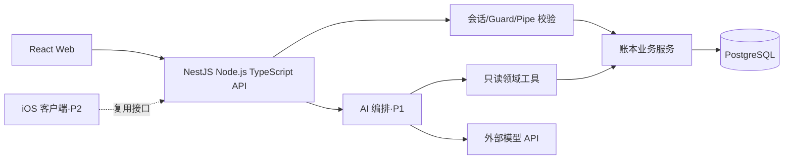
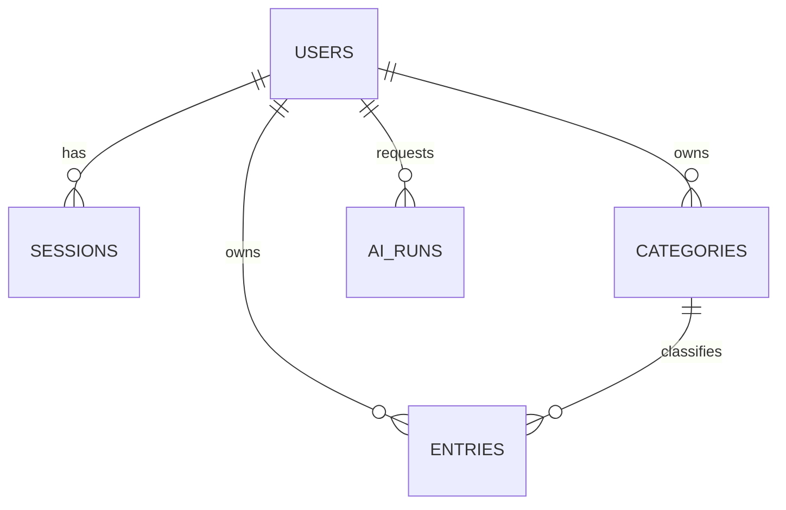

# PRD｜个人账本与 AI 分析助手（全栈学习项目）

- 版本：v1.1（NestJS 后端框架修订，开发依据）
- 日期：2026-10-08
- 产品性质：个人学习作品、虚构账单数据演示；**不是支付系统、理财建议产品或生产财务系统**
- 目标技术路径：React + TypeScript 前端、NestJS（Node.js + TypeScript）服务、PostgreSQL、受限的 AI 问答
- 预计投入：约 5 小时/周，24 周约 120 小时；里程碑是目标，不以熬夜补进度

## 1. 背景、选择与目标

用户已有钱包 H5、RN/跨端和 iOS 开发背景；现有代码还展示过 Node/Express 页面服务、Java/Spring MVC 页面控制器，以及“模型提取参数—校验—调用业务函数”的 AI 辅助能力。本项目不复制内部代码或数据，而是用一个**可独立交付的小产品**补足服务端数据、可靠性、部署和 AI 工程闭环。

选题比较：

| 方案 | 优点 | 不选作本期主方案的原因 |
|---|---|---|
| **虚构账本 + AI 分析（本方案）** | 同时练表结构、权限、金额精度、事务/幂等、统计查询、前端和受限 AI 工具 | 需要严守“无真实支付、无真实个人数据”边界 |
| 纯知识库问答 | AI/RAG 上手快 | SQL、事务和业务后端练习不足 |
| 模拟完整支付平台 | 与钱包业务相近 | 范围、合规和安全复杂度远超每周 5 小时的学习项目 |

**产品目标**：用户能够记录虚构收支、查看可核对的月报，并用自然语言询问自己的账本。AI 只解释由服务端算出的事实，不创建、修改、删除账目。

**学习目标**：独立交付“浏览器 → Node API → PostgreSQL → 测试/CI/部署/观测 → AI 受限工具”的闭环。这里的“完整后端”指常用工程核心能力，不宣称一个项目覆盖分布式系统、数据库内核、模型训练等全部领域。

**成功定义**：在全新环境中按文档启动应用、运行迁移和虚构数据种子；两个测试账号的数据互不可见；账本/月报结果可与数据库独立核对；CI 可运行；AI 的数值、来源和拒绝行为经过固定样例集评估。

## 2. 用户、边界与优先级

**主要用户**：学习者本人，使用 Web 管理账本；**演示用户**：经邀请使用虚构数据验证功能；**未来可选客户端**：iOS，复用相同 API，不另做一套后端。

**MVP（P0，第 1–10 周）**：登录/退出、分类管理、收支增删改查、筛选分页、月度汇总、响应式 Web 界面、基础权限与自动化测试。

**增强（P1，第 11–24 周）**：幂等的并发/超时场景与失败恢复、索引和性能检查、部署/备份演练、日志与监控；随后上线只读 AI 问答与评测。

**以后再做（P2）**：预算、CSV 导入/导出及异步任务、Redis 缓存、iOS 客户端、MCP 工具复用、复杂图表和多币种。

**明确不做**：真实银行卡/支付/转账、银行账户同步、真实用户财务数据、公开注册、大模型直接执行 SQL、自动理财决策、模型训练、多 Agent 自主操作。演示环境仅使用生成的数据，公开部署时限制访问。

**固定产品假设**：MVP 仅支持 CNY，精度到分；月报按 `Asia/Shanghai` 自然月计算；系统存储 UTC 时间；个人数据以登录账号隔离。币种和时区扩展必须重新定义报表规则，不暗中换算。

## 3. 用户旅程与前端需求

### 3.1 主要旅程

1. 用户以预置/受邀账号登录，进入当月概览；首次登录看到空状态和“添加第一笔记录”。
2. 选择“支出/收入”、分类、金额、发生时间和可选备注，提交后看到明确的成功或失败反馈。
3. 在列表中按月份、方向、分类筛选，查看或编辑自己的记录；删除前二次确认。
4. 在月报查看收入、支出、结余、分类分布，点击分类下钻到对应记录。
5. 输入“上月交通花了多少”，得到结论、统计口径和可追溯的聚合证据；没有数据或问题越界时得到明确说明。

### 3.2 页面与交互验收

| 编号 | 页面/功能 | 必须满足的行为 | 优先级 |
|---|---|---|---|
| FE-01 | 登录页 | 登录、退出、会话过期跳回登录；错误信息不泄露账号是否存在 | P0 |
| FE-02 | 概览页 | 展示当前月收入/支出/结余及分类汇总；空数据不是零数据图表的伪装 | P0 |
| FE-03 | 流水列表 | 月份、方向、分类筛选，20 条/页；加载、空、失败、重试均有明确状态 | P0 |
| FE-04 | 新增/编辑流水 | 金额最多两位小数且必须大于 0；分类随收支方向过滤；服务端校验失败可定位字段 | P0 |
| FE-05 | 删除流水 | 二次确认；删除后列表和月报一致更新；重复操作不制造错误记录 | P0 |
| FE-06 | 分类管理 | 新增/改名/归档；已有历史记录的分类归档后仍能显示历史名称 | P0 |
| FE-07 | 月报 | 统计口径、月份、CNY 单位清晰；分类合计与总额一致，能下钻 | P0 |
| FE-08 | AI 提问 | 提供示例问题、等待/失败/超时状态；展示事实卡片和来源，不把模型文本当数据库结果 | P1 |

**界面要求**：React + TypeScript + Vite；移动端 360px 起和桌面响应式；用路由管理页面、查询缓存管理服务端状态，表单状态局部管理，不因学习目的强行引入 Redux。所有核心表单可用键盘操作，具备标签、错误提示和可读的汇总表；图表不能是唯一的信息载体。请求重复点击时沿用同一个请求幂等键，不生成重复账目。

## 4. 系统结构与技术边界



- **Node 主栈**：Node.js LTS + TypeScript strict + NestJS（Express HTTP 适配器）。按 `Auth`、`Categories`、`Entries`、`Reports` 与 P1 的 `Ai` 模块组织 Controller → Service → Repository；用 Pipe 校验输入、Guard 校验会话身份，以依赖注入管理边界。仍需学习 Node 异步 I/O、HTTP、Express 中间件和错误链；不能让框架装饰器代替 SQL、权限和事务，也不同时引入 Fastify、微服务或第二套后端框架。
- **数据库**：PostgreSQL；版本化 SQL 迁移；使用参数化查询与受控连接池。先学明白 SQL、约束、索引、事务和 `EXPLAIN`，不以 ORM 代替这些知识。
- **API 契约**：`/api/v1`、JSON、从服务端 Controller 与校验 Schema 生成并核对的 OpenAPI 文档；所有金额在 API 中用**分的十进制字符串**传输，避免 JavaScript 浮点与大整数精度问题。
- **环境**：本地 Node + PostgreSQL（可用 Docker Compose）；预览环境同源 HTTPS 部署 Web 与 API，避免把 CORS 配置当作产品功能。前端不持有模型密钥或数据库凭证。

## 5. API 契约

登录会话使用成熟认证/会话库；账号通过本地种子或受控邀请建立，不提供公开注册。所有业务接口从服务端会话取得 `userId`，**不接受客户端或模型传入的 userId 作为授权依据**。

| 接口 | 请求要点 | 成功行为 | 核心错误 |
|---|---|---|---|
| `POST /api/v1/auth/login` | 用户名、密码 | 创建服务端会话并设置 HttpOnly Cookie | 401、429 |
| `POST /api/v1/auth/logout` / `GET /api/v1/auth/me` | Cookie | 失效会话 / 返回当前用户 | 401 |
| `GET /api/v1/categories` / `POST /api/v1/categories` | 按方向查；新增需名称和方向 | 只返回本人分类 | 400、401、409 |
| `PATCH /api/v1/categories/{id}` | 改名或归档；方向不可改 | 历史流水仍可读 | 400、404、409 |
| `GET /api/v1/entries` | `month=YYYY-MM`、可选方向/分类、`page`、`pageSize≤100` | 本人未删除流水和分页信息 | 400、401 |
| `POST /api/v1/entries` | 方向、分类、`amountMinor`、发生时间、备注；必带 `Idempotency-Key` | 原子创建一笔流水 | 400、404、409 |
| `PATCH /api/v1/entries/{id}` / `DELETE /api/v1/entries/{id}` | 修改或软删除本人流水 | 列表、报表随之更新；重复删除返回 204 | 400、404 |
| `GET /api/v1/reports/monthly` | `month=YYYY-MM` | 收入、支出、结余及分类合计 | 400、401 |
| `POST /api/v1/ai/questions` | `question`，最长 500 字 | 回答、事实卡片、证据、`requestId` | 400、401、429、503 |
| `GET /api/v1/health` | 无 | 仅提供不含秘密的存活状态 | 503 |

创建流水请求示例（`Idempotency-Key` 为客户端生成并在重试时保持不变的 UUID）：

```json
{
  "direction": "expense",
  "categoryId": "8f93b338-9449-49d2-b633-763442dd55d3",
  "amountMinor": "32050",
  "currency": "CNY",
  "occurredAt": "2026-09-15T12:30:00+08:00",
  "note": "虚构交通支出"
}
```

月报响应中的金额字段同样是分的字符串：`incomeTotalMinor`、`expenseTotalMinor`、`netMinor`，以及各分类的 `amountMinor` 和 `entryCount`。失败统一为 `{"error":{"code":"VALIDATION_ERROR","message":"...","requestId":"...","fields":{}}}`；401 表示未登录，其他人的对象统一返回 404 防止枚举；同一幂等键不同请求体返回 409；AI 上游不可用返回 503，**不得伪造 AI 回答**。

幂等语义：同一用户、同一键、同一请求体重复提交，返回首次创建的资源和等价响应；不同请求体用同一键返回 409。关键检查和写入在同一数据库事务内完成，接口超时后客户端重试不会重复记账。

## 6. 数据库模型与一致性



| 表 | 关键字段 | 约束与用途 |
|---|---|---|
| `users` | `id UUID`、`username`、`password_hash`、`created_at` | 用户名规范化后唯一；密码只用成熟库安全哈希，不存明文 |
| `sessions` | 会话标识的哈希、`user_id`、`expires_at` | 由成熟会话库管理；退出/过期后失效 |
| `categories` | `id`、`user_id`、`direction`、`name`、`archived_at` | 同用户/方向下有效分类名称唯一；`(user_id,id)` 唯一以支持同用户复合外键；有历史流水时只能归档 |
| `entries` | `id`、`user_id`、`category_id`、`direction`、`amount_minor BIGINT`、`currency`、`occurred_at`、`note`、`client_request_id`、`deleted_at`、创建/更新时间 | 金额严格大于零；MVP 仅 CNY；`(user_id,client_request_id)` 唯一；分类必须属于该用户且方向一致；删除不参与月报 |
| `ai_runs`（P1） | `id`、`user_id`、`request_id`、`model_id`、`status`、`tool_names`、`token_count`、`latency_ms`、`created_at` | 只记运行元数据，不存原始问题、密码或完整账单 |

**数据规则**：

1. `entries(user_id,category_id)` 与 `categories(user_id,id)` 建立可校验的同用户关联；服务层仍要验证权限和分类方向。归档分类不可用于新增，但不影响历史月报。
2. 月报只统计未删除流水，时间范围为上海时区所选月份的 `[月初, 次月初)`，换算成 UTC 查询；`净额 = 收入 - 支出`，不跨币种加总。
3. 对 `entries(user_id,occurred_at DESC,id DESC)` 建立面向有效流水的索引；分页和月报在虚构数据量增加后用 `EXPLAIN ANALYZE` 检查，先测量再加缓存。
4. 每次结构变更提交可审阅的迁移；预览环境先迁移并演练备份/恢复。`BIGINT`/聚合值在 Node 和 JSON 中以十进制字符串处理，不能经由 `Number` 丢失精度。
5. 更新暂按“最后一次有效提交生效”；并发编辑的乐观锁为 P2。失败的事务不得留下半笔账、残留幂等记录或错误月报。

## 7. AI 功能需求与安全边界

**场景**：询问“2026 年 9 月交通支出多少”“与 8 月相比怎样”“上月有没有记录”。AI 负责解析月份/意图与选择预定义工具，**数据库查询、金额求和与差额计算均在服务端确定性完成**。数值类结论由服务端根据工具事实生成或校验，模型不能编造金额、来源或记录。

**允许工具**（工具参数不包含 `userId`，用户身份由服务端注入）：

- `getMonthlySummary(month)`：该用户该月收入、支出、结余、记录数。
- `getCategoryBreakdown(month, direction)`：该用户该月各分类合计。
- `listEntries(start, end, categoryId?, limit≤20)`：返回该用户有限条、必要字段；MVP 不把备注内容传给模型。

**禁止能力**：写账、付款、删除、执行任意 SQL、访问其他用户、调用任意外部 URL、让模型决定权限。模型要求这些操作时说明能力边界；不因为提示词或工具结果里的指令而改变权限。所有模型调用经 Node 服务，设置单次超时、请求长度/频率、每日成本上限；调用失败保留普通月报入口，不装作 AI 成功。

**响应**：自然语言说明 + 服务端验证的事实卡片（金额、月份、分类）+ 聚合来源（统计口径、记录数）+ `requestId`；数据为空必须明确说“该月无记录”，问题含糊时先询问月份或使用已展示的默认月份并显式标注。

**评测集**：至少 30 个虚构数据问题，覆盖正确查询与跨月比较、无数据/歧义、越权与写操作请求、恶意输入。验收目标：数值事实在固定样例上 **100%** 与服务端计算一致；越权数据返回和写操作 **0 次**；意图/工具选择在人工标注样例中至少 **90%** 正确。记录成功率、失败类别、模型版本、耗时与成本；模型上游失败单独统计，不用测试桩冒充真实模型验收。RAG、MCP、多 Agent 仅在出现文档检索或工具复用的明确需求后进入 P2。

## 8. 非功能需求、测试与上线

| 维度 | 要求与可验证方式 |
|---|---|
| 安全 | HTTPS；HttpOnly、Secure、SameSite Cookie；状态修改请求做 CSRF/Origin 校验；服务端逐对象鉴权、参数校验和 SQL 参数化；密码/密钥不入仓库，日志脱敏；演示环境禁真实财务数据。 |
| 可靠性 | 数据库失败回滚；创建接口幂等；异常返回有稳定错误码和 `requestId`；模型故障不影响普通记账与月报。 |
| 性能 | 用至少 1 万条虚构流水检查查询计划；在记录硬件和环境的预览测试中，非 AI 月报接口目标 p95 < 500ms；AI 目标 p95 < 12s，超时给明确错误。这是验收目标，不是现有实测或商业 SLA。 |
| 隐私 | 不记录明文密码、会话、完整账本或原始 AI 问题；模型输入只带回答所需的最小聚合数据；提供删除演示数据的受控管理方式。 |
| 可访问性 | 主要流程可键盘操作，有输入标签/错误提示；统计数据有可读表格，不仅靠颜色或图形区分。 |
| 可维护性 | NestJS 模块边界、Provider 依赖方向和单一 API 契约清晰；TypeScript 类型检查、格式与 lint、迁移、测试和构建在 CI 中执行。 |
| 可观测性 | 请求 ID 串联前端错误、API、数据库查询和 AI 运行；记录状态码、耗时、错误码、工具名与成本，不记录敏感正文；可查看错误率及慢查询。 |
| 恢复 | 预览部署写明环境变量清单、启动/迁移步骤、备份与恢复演练方法；演示用户数据可重新生成。 |

**测试矩阵**：

- 单元测试：金额转换/范围、月份边界、分类方向、统计公式、错误映射。
- PostgreSQL 集成测试：迁移、唯一约束、跨用户分类引用、事务回滚、相同/冲突幂等键、软删除后月报更新。
- API 测试：通过 Nest TestingModule 启动真实 HTTP 应用，检查 Guard/Pipe/异常过滤后的未登录、A 用户访问 B 用户、参数非法、分页边界、429/503 和失败响应结构。
- Web 端到端测试：登录 → 分类 → 新增 → 月报核对 → 编辑/删除 → 退出；覆盖空态和失败重试。
- AI 测试：离线固定工具结果测试权限与格式；在虚构数据上进行真实模型评测，单独报告其通过率与成本。
- CI 门禁：依赖锁定安装、lint、类型检查、单元/集成测试、前端构建与迁移检查；未经验证不宣称上线成功。

## 9. 学习知识地图与验收产物

| 能力 | 项目任务 | 证明“会了”的产物 |
|---|---|---|
| Web 前端 | React 组件、表单、路由、服务端状态、响应式和可访问性 | 主要流程能在手机/桌面完成，并有 E2E 测试 |
| Node 与 HTTP | 事件循环/异步 I/O、Express 适配器中间件、Nest Controller/Guard/Pipe/Filter、状态码、Cookie、超时和错误链 | API 契约、可追踪请求、失败测试；能解释一次请求完整经过哪些边界 |
| 服务设计 | Nest Module/Provider/依赖注入、Controller/领域服务/Repository 边界、输入校验、鉴权 | 替换数据层不会改动页面契约；跨用户请求被拒绝；测试可替换外部模型适配器 |
| SQL 与数据库 | DDL/DML、迁移、FK/唯一约束、聚合、索引、事务与隔离 | 真实 PostgreSQL 集成测试、月报 SQL 与查询计划 |
| 安全与可靠性 | 密码/会话库、权限、CSRF、幂等、重试、限流、秘密管理 | 越权、重复提交、失败回滚与脱敏用例通过 |
| 工程交付 | CI、容器/部署、环境配置、备份恢复、日志/指标 | 从干净环境复现、预览环境可验收、能定位失败请求 |
| AI 应用工程 | 结构化输出、受限工具、可追溯事实、评测、安全/成本 | 30 条评测记录、错误分类、真实模型成本/延迟记录 |
| 算法基础（并行） | 数组/哈希、二分/滑窗、树图遍历、堆与基础 DP；每周 1–2 题 | 自己解释复杂度和边界，隔周不看答案重做；不拿刷题数量代替产品验收 |

缓存、消息队列、分布式事务、Kubernetes、模型训练不属于 P0/P1 的必需知识；学习广度不等于把所有技术都塞进 MVP。

### 9.1 P2 专项实验（24 周后，独立验收）

- **异步任务**：仅在需要批量导入虚构 CSV 时，引入任务队列和 worker；验收“上传校验 → 任务状态/进度 → 失败记录可下载 → 重试不重复入账”，并设置文件大小、行数和并发上限。
- **缓存**：只有月报查询的真实性能数据证明有瓶颈时才引入 Redis；验收“命中/未命中数值一致，新增/编辑/删除后缓存失效，跨用户键绝不串数据”。先比较 SQL 索引优化效果。
- **客户端复用**：用熟悉的 iOS 技术调用同一套鉴权与账本 API；验收 Web 与 iOS 对金额、月份、错误码和权限的解释一致。
- **进一步的后端主题**：限流与背压、连接池容量、容器资源、故障注入可按实际瓶颈各选一个实验；不为了练习而拆微服务或引入分布式事务。

## 10. 里程碑、工时与降级规则

| 周次 | 约可用时间 | 验收成果 |
|---|---:|---|
| W1–4 | 20 小时 | NestJS 单体骨架和首个模块、数据库迁移、两名虚构用户、登录与第一笔流水；能解释 Guard/Pipe/Controller/Service/Repository 的端到端请求 |
| W5–10 | 30 小时 | 分类/流水/月报和 Web 主要页面；跨用户、金额、日期、空态及基本幂等测试；P0 可演示 |
| W11–16 | 30 小时 | 幂等并发/事务故障/索引验证、CI、预览部署、日志、备份恢复演练；普通业务出错可定位 |
| W17–22 | 30 小时 | 只读 AI 工具、事实卡片、安全边界、30 条评测与真实模型成本记录 |
| W23–24 | 10 小时 | 修复高优先级缺陷、复查验收矩阵、整理架构图和演示说明，不再加新功能 |

**框架学习预算**：W1–4 只搭一个 NestJS 单体和最小垂直切片；NestJS 的依赖注入与请求生命周期会增加初期学习成本。若 20 小时不够，顺延功能和 P1，不为保进度跳过鉴权、真实 PostgreSQL 测试或基础 SQL 练习。

**每周建议**：工作日最多 2–3 次 20–25 分钟阅读/算法复盘；周末两次约 2 小时的项目深度工作，另外保留休息。若通勤是单程一小时或当周加班更多，优先减少范围：先推迟 AI 和图表，再推迟公开预览；**不得通过省略权限、数据库约束、测试或睡眠来“按时完成”**。算法若是短期面试重点，可暂停 AI 阶段、把相同时间暂时给算法。真实工作中若能参与一个 Node/Java 服务端需求和代码评审，优先把那段实践纳入学习闭环。

## 11. 总体验收与交付清单

- [ ] 目录中只有个人项目代码与虚构数据；没有公司代码、生产配置、真实账单或密钥。
- [ ] Web 可完成登录、分类、流水、月报；iOS 为可选后续扩展，不阻塞本版验收。
- [ ] NestJS API 有清晰模块依赖、版本和错误契约；Guard/Pipe 不代替服务端逐对象鉴权、幂等和 OpenAPI 描述。
- [ ] PostgreSQL 有迁移、约束、索引、事务测试；金额和月份口径可独立复核。
- [ ] 普通记账在模型不可用时仍正常；AI 只能读受授权聚合，回答可追溯并通过评测。
- [ ] CI、启动/部署、脱敏观测、备份恢复演练有明确证据；未验证的项目不标记完成。
- [ ] 开发记录能说明关键取舍：为何不用真实支付、为何选 NestJS 单体与 Express 适配器、何时才需要缓存/队列/RAG/MCP。

本 PRD 是**以“虚构账本”为产品载体的学习规格**。若最终目标改为纯 AI 知识库或公司内部业务系统，必须先重新定义数据边界、用户权限和验收指标，不能把本文件中的财务数据结构直接照搬。
